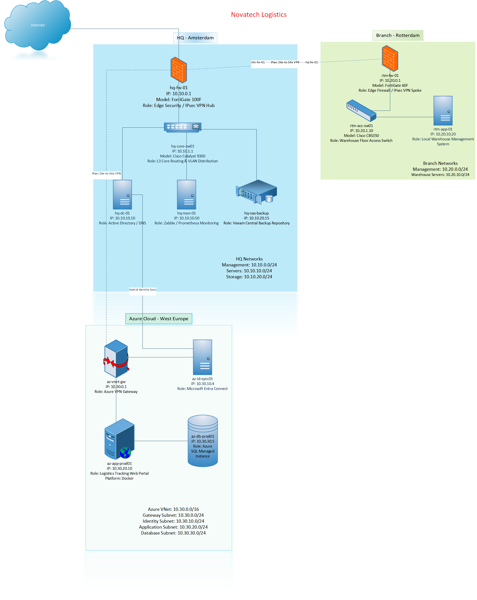

# Novatech Logistics Infrastructure Lab

A portfolio project documenting the planned hybrid infrastructure of a fictional logistics company, with network diagrams, a YAML asset inventory, and Python-based inventory automation.

## Project Overview

Novatech Logistics operates across three locations:

- Headquarters: Amsterdam, Netherlands
- Warehouse branch: Rotterdam, Netherlands
- Cloud environment: Azure West Europe

This repository brings together infrastructure documentation, network diagrams, and an automated inventory reporting workflow.

The architecture represents a lab design. Documentation and diagrams do not imply that all services have been deployed or tested.

## Architecture Overview

### HQ — Amsterdam

The headquarters hosts the central infrastructure:

- `hq-fw-01`: Edge firewall and site-to-site VPN endpoint
- `hq-core-sw01`: Layer 3 core switch
- `hq-dc-01`: Active Directory Domain Services and DNS
- `hq-mon-01`: Infrastructure monitoring server
- `hq-nas-backup`: Central backup repository

### Branch — Rotterdam

The warehouse branch contains:

- `rtm-fw-01`: Edge firewall and site-to-site VPN endpoint
- `rtm-acc-sw01`: Access switch
- `rtm-app-01`: Warehouse Management System application server

The branch connects to HQ through an IPsec site-to-site VPN.

### Azure — West Europe

The planned cloud environment contains:

- `az-vnet-gw`: Azure VPN Gateway
- `az-id-sync01`: Windows VM running Microsoft Entra Connect Sync
- `az-app-prod01`: VM hosting a Docker-based logistics application
- `az-db-prod01`: Azure SQL Managed Instance

The Azure virtual network connects to HQ through a site-to-site VPN.

The identity synchronization server requires connectivity to the on-premises Active Directory environment and outbound connectivity to Microsoft Entra ID.

## Network Diagram



The editable diagram is stored in the `diagrams/` directory in Visio or draw.io format.

### Main Logical Connections
```text
Internet
  |
  hq-fw-01
  |
  hq-core-sw01
  |-- hq-dc-01
  |-- hq-mon-01
  `-- hq-nas-backup

rtm-fw-01
  |
  rtm-acc-sw01
  `-- rtm-app-01

rtm-fw-01 <--- IPsec site-to-site VPN ---> hq-fw-01

hq-fw-01 <--- IPsec site-to-site VPN ---> az-vnet-gw

hq-dc-01 <--- AD connectivity over VPN ---> az-id-sync01
az-id-sync01 ---> Microsoft Entra ID

az-app-prod01 ---> az-db-prod01

These connections describe logical relationships. They do not represent a complete physical cabling plan or firewall policy.

## IP Addressing Plan

The following addresses describe the lab addressing plan.

Device addresses are inventory references, not a complete list of routed interfaces, VLAN gateways, or firewall interfaces.

### HQ — Amsterdam

| Asset | Planned IP Address | Subnet | Purpose |
|---|---|---|---|
| hq-fw-01 | 10.10.0.1 | 10.10.0.0/24 | Firewall interface |
| hq-core-sw01 | 10.10.1.1 | 10.10.1.0/24 | Core switch management or routed interface |
| hq-dc-01 | 10.10.10.10 | 10.10.10.0/24 | Active Directory and DNS |
| hq-mon-01 | 10.10.10.50 | 10.10.10.0/24 | Monitoring |
| hq-nas-backup | 10.10.20.15 | 10.10.20.0/24 | Backup storage |

### Branch — Rotterdam

| Asset | Planned IP Address | Subnet | Purpose |
|---|---|---|---|
| rtm-fw-01 | 10.20.0.1 | 10.20.0.0/24 | Firewall interface |
| rtm-acc-sw01 | 10.20.1.10 | 10.20.1.0/24 | Switch management |
| rtm-app-01 | 10.20.10.20 | 10.20.10.0/24 | Warehouse application |

### Azure — West Europe

Planned virtual network address space:

text
10.30.0.0/16

| Resource | Planned Address or Endpoint | Subnet | Purpose |
|---|---|---|---|
| az-vnet-gw | Azure-managed allocation | 10.30.0.0/24 — GatewaySubnet | Site-to-site VPN |
| az-id-sync01 | 10.30.10.4 | 10.30.10.0/24 | Identity synchronization VM |
| az-app-prod01 | 10.30.20.10 | 10.30.20.0/24 | Application VM |
| az-db-prod01 | Service-provided DNS endpoint | 10.30.30.0/24 | SQL Managed Instance |

Azure VPN Gateway uses a dedicated subnet named `GatewaySubnet`.

The SQL Managed Instance subnet is dedicated to the managed service. Applications should use its service-provided DNS endpoint.

## Repository Structure

text
infra-labs/
├── README.md
├── .gitignore
├── requirements.txt
├── data/
│   └── inventory.yaml
├── docs/
│   └── inventory.md
├── diagrams/
│   ├── network-overview-v1.png
│   └── network-overview-v1.vsdx
└── scripts/
└── render_inventory.py

If draw.io is used, the editable diagram can be stored as `network-overview-v1.drawio` instead of the Visio file.

## Repository Contents

| Path | Description |
|---|---|
| `README.md` | Project overview and usage instructions |
| `data/inventory.yaml` | Structured infrastructure inventory |
| `scripts/render_inventory.py` | Inventory rendering script |
| `docs/inventory.md` | Generated Markdown inventory report |
| `diagrams/network-overview-v1.png` | Network diagram preview |
| `diagrams/network-overview-v1.vsdx` | Editable Visio diagram, when available |
| `requirements.txt` | Python dependencies |
| `.gitignore` | Local files excluded from version control |

## Working Environment

Repository maintenance and Python automation are performed on Ubuntu Server without a graphical desktop.

Required tools:

- Python 3
- Python virtual environment support
- Git
- A terminal text editor such as nano

Diagram editing is performed on a workstation using Visio or draw.io. Diagram files are then transferred to the server.

## Inventory Automation

Run the following commands from the repository root.

### Create a Virtual Environment

bash
python3 -m venv .venv

### Activate the Virtual Environment

bash
source .venv/bin/activate

### Install Dependencies

bash
python -m pip install -r requirements.txt

### Generate the Inventory Report

bash
python scripts/render_inventory.py

Expected report location:

text
docs/inventory.md

### Review the Report

bash
less docs/inventory.md

Press `q` to exit the viewer.

### Leave the Virtual Environment

bash
deactivate

## Updating the Inventory

1. Edit the source inventory.
2. Run the rendering script.
3. Review the generated report.
4. Commit the source and report together.

bash
nano data/inventory.yaml
source .venv/bin/activate
python scripts/render_inventory.py
git diff -- data/inventory.yaml docs/inventory.md
git add data/inventory.yaml docs/inventory.md
git commit -m "docs: update infrastructure inventory"

## Updating the Diagram

1. Edit the source diagram on a workstation.
2. Export a PNG named `network-overview-v1.png`.
3. Transfer the PNG and editable source file to `diagrams/`.
4. Review and commit the updated files.

The README image uses this relative path:

text
diagrams/network-overview-v1.png

Keep the filename and capitalization consistent with the file stored in Git.

## Documentation Checks

Run these commands from the repository root to check that the main documentation files exist:

bash
ls -lh README.md
ls -lh data/inventory.yaml
ls -lh scripts/render_inventory.py
ls -lh docs/inventory.md
ls -lh diagrams/network-overview-v1.png

Review pending changes before committing:

bash
git status
git diff --check
git diff -- README.md

These checks verify documentation files and changes. They do not validate network connectivity or deployed infrastructure.

## Project Scope

This project demonstrates:

- Hybrid infrastructure planning
- Logical network documentation
- Asset inventory organization
- IPv4 subnet planning
- Active Directory and hybrid identity concepts
- Site-to-site VPN architecture
- Backup and monitoring documentation
- YAML-based infrastructure data
- Python inventory automation
- Git-based version control

## Disclaimer

Novatech Logistics is a fictional company.

All names, infrastructure assets, and network addresses are examples for learning and portfolio demonstration. They do not describe a real production environment.
`
## 🚀 Quick Start

Follow these steps to run this project locally and generate the inventory report:
```bash
# 1. Clone the repository
git clone https://github.com/davood-naseri/infra-labs.git
cd infra-labs

# 2. Set up virtual environment
python3 -m venv venv
source venv/bin/activate
pip install pyyaml

# 3. Render inventory
python3 scripts/render_inventory.py


